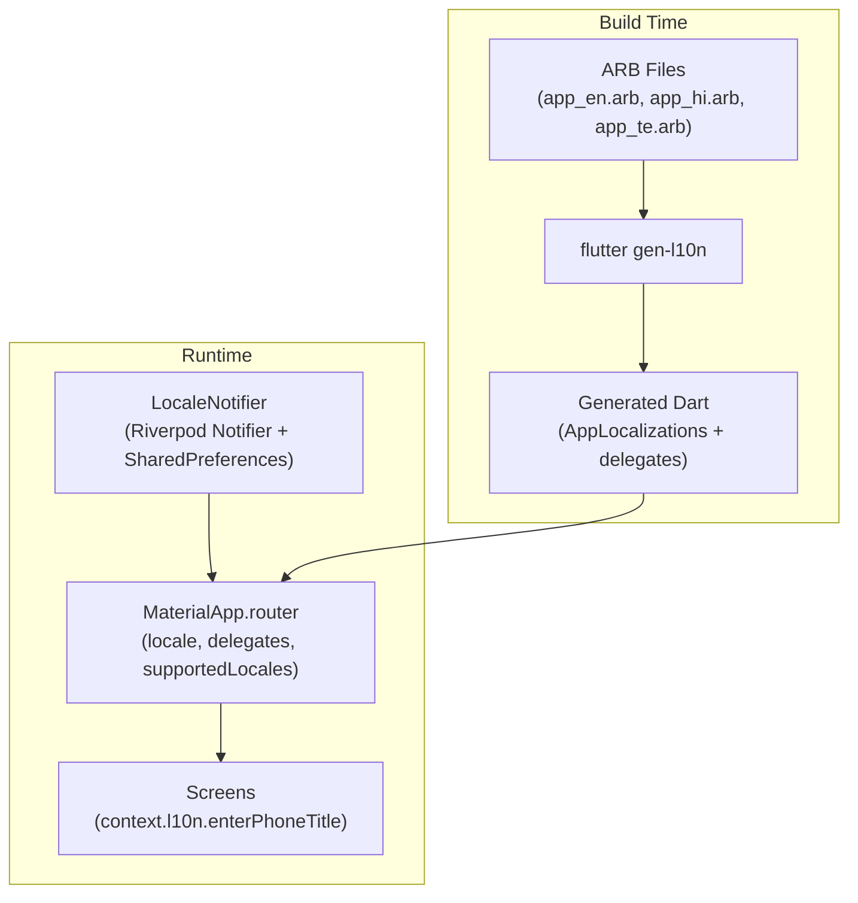

# Production-Grade Multi-Language Localization

## Strategy: Flutter Official gen-l10n

We use **Flutter's built-in localization** (`flutter_localizations` SDK package + `flutter gen-l10n` code generation). This is the only approach that satisfies all constraints:

- **Zero additional packages** -- `flutter_localizations` ships with the SDK, `intl` is already in pubspec
- **Compile-time type safety** -- generated `AppLocalizations` class with typed accessors; typos caught at build time
- **No runtime overhead** -- strings compiled into Dart classes, no JSON parsing, no file I/O
- **Negligible app size** -- ~320 strings x 3 locales x ~50 bytes = ~48KB total (less than one icon)
- **No jank** -- locale switch triggers a single `MaterialApp` rebuild (identical mechanism to existing theme toggle)
- **Deferred loading on web** -- locale classes loaded on demand if the app ever targets web




## Architecture

### File Structure (new/modified files)

```
lib/
├── l10n/
│   ├── app_en.arb          # English (template - source of truth)
│   ├── app_hi.arb          # Hindi translations
│   └── app_te.arb          # Telugu translations
├── core/
│   ├── auth/
│   │   └── auth_state.dart  # AuthErrorType enum added here
│   ├── l10n/
│   │   └── l10n_extension.dart   # context.l10n shorthand extension
│   └── providers/
│       └── locale_provider.dart  # LocaleNotifier (modern Notifier pattern)
l10n.yaml                    # gen-l10n configuration (project root)
```

### l10n.yaml Configuration

```yaml
arb-dir: lib/l10n
template-arb-file: app_en.arb
output-localization-file: app_localizations.dart
output-class: AppLocalizations
synthetic-package: true
nullable-getter: false
```

Key choices and caveats:

- `synthetic-package: true` -- generated code goes to `.dart_tool/flutter_gen/gen_l10n/` (not checked into source). Combined with `generate: true` in `pubspec.yaml`, `flutter build` / `flutter run` / `flutter test` all auto-trigger generation. **Raw `dart analyze` without `flutter` will NOT auto-generate** -- CI pipelines should use `flutter analyze` or run `flutter gen-l10n` explicitly as a pre-step.
- `nullable-getter: false` -- `AppLocalizations.of(context)` returns non-null. **Constraint:** `context.l10n` must only be called within the localized `MaterialApp` widget tree. The error-fallback `MaterialApp` in `main.dart` (crash recovery, outside locale scope) must use hardcoded English strings -- this is acceptable since it's a catastrophic-failure path.

### ARB Key Naming Convention

Keys match existing `AppStrings` constant names exactly (camelCase), making migration mechanical:

```json
{
  "@@locale": "en",
  "appName": "Anuyatra",
  "@appName": { "description": "Brand name - do not translate" },
  "enterPhoneTitle": "Enter your phone number",
  "registeringAs": "Registering as: {role}",
  "@registeringAs": {
    "placeholders": { "role": { "type": "String" } }
  }
}
```

### Context Extension (`context.l10n`)

```dart
// lib/core/l10n/l10n_extension.dart
import 'package:flutter/widgets.dart';
import 'package:flutter_gen/gen_l10n/app_localizations.dart';

/// Shorthand for AppLocalizations.of(context).
///
/// MUST only be called within the localized MaterialApp widget tree.
/// Calling outside (e.g. in the error-fallback MaterialApp in main.dart)
/// will throw because no AppLocalizations ancestor exists.
extension LocalizationX on BuildContext {
  AppLocalizations get l10n => AppLocalizations.of(this);
}
```

### LocaleNotifier (Riverpod -- Modern Notifier Pattern)

Uses `Notifier` / `NotifierProvider` (NOT the deprecated `StateNotifier`). The existing `ThemeModeNotifier` in [lib/core/providers/theme_provider.dart](lib/core/providers/theme_provider.dart) uses `StateNotifier` -- that's legacy and won't be copied. The new provider follows current Riverpod best practice:

```dart
class LocaleNotifier extends Notifier<Locale?> {
  // null = follow system locale (default behavior)
  // non-null = user explicitly chose a language

  @override
  Locale? build() {
    _loadLocale();
    return null;  // default: system locale
  }

  Future<void> setLocale(Locale locale) async { ... }
  Future<void> useSystemLocale() async { ... }
}

final localeProvider = NotifierProvider<LocaleNotifier, Locale?>(
  LocaleNotifier.new,
);
```

Persisted to `SharedPreferences` under key `app_locale`.

### MaterialApp Integration

In [lib/main.dart](lib/main.dart), the `MaterialApp.router` gets three new properties:

```dart
final locale = ref.watch(localeProvider);

MaterialApp.router(
  locale: locale,    // null = system default
  localizationsDelegates: AppLocalizations.localizationsDelegates,
  supportedLocales: AppLocalizations.supportedLocales,
  // ... existing theme, router, etc.
)
```

The error-fallback `MaterialApp` (lines 78-84) stays with hardcoded English -- it renders outside the locale scope and is a crash-recovery path only.

### Language Picker Widget

A `LanguagePickerTile` widget (same pattern as `ThemeToggleButton`) for the settings screen. Shows current language name in native script, opens a dialog with options:

- **System Default** (device language)
- **English**
- **Hindi** (हिन्दी)
- **Telugu** (తెలుగు)

## Context-Free Strings: AuthError Enum Strategy

### Problem

`AuthNotifier` ([lib/core/auth/auth_provider.dart](lib/core/auth/auth_provider.dart)) has 7 hardcoded English error strings passed via `AuthError(message: '...')`. It's a `StateNotifier` with no `BuildContext` -- it cannot call `context.l10n`.

```dart
// Current (broken for i18n):
state = AuthError(message: 'Please enter a valid 10-digit Indian mobile number.');
```

### Solution: Typed Error Enum

Add `AuthErrorType` enum to [lib/core/auth/auth_state.dart](lib/core/auth/auth_state.dart):

```dart
enum AuthErrorType {
  invalidPhone,
  sendOtpFailed,
  invalidOtp,
  invalidOtpWithHint,
  verificationFailed,
  profileSetupFailed,
  userNotFound,
}
```

Refactor `AuthError` to carry the enum (and optional context data) instead of a raw string:

```dart
class AuthError extends AuthState {
  final AuthErrorType errorType;
  final String? detail;  // e.g. the demo OTP hint, or exception message
  final AuthState? previousState;
  // ...
}
```

The **widget layer** resolves the enum to a localized string:

```dart
// In the screen that reads AuthError:
String _resolveAuthError(BuildContext context, AuthError error) {
  final l10n = context.l10n;
  switch (error.errorType) {
    case AuthErrorType.invalidPhone:
      return l10n.invalidPhoneError;
    case AuthErrorType.invalidOtpWithHint:
      return l10n.invalidOtpWithHint(error.detail ?? '123456');
    case AuthErrorType.sendOtpFailed:
      return l10n.sendOtpFailed;
    // ...
  }
}
```

This keeps the provider pure (no UI concerns) and lets translation happen where `BuildContext` is available.

## Font Handling for Regional Scripts

### Current State

- `AppTypography` uses `GoogleFonts.inter()` (body) and `GoogleFonts.poppins()` (display) -- neither contains Devanagari or Telugu glyphs.
- `pubspec.yaml` declares `HaskoyRegular`, `HaskoyMedium`, `HaskoyBold` fonts (lines 53-62) but **no Dart file references Haskoy anywhere** -- these are dead weight adding ~100-300KB to the bundle. They should be removed.

### Fallback Behavior

When Inter/Poppins encounter a glyph they lack (Hindi/Telugu characters), Flutter's text rendering engine falls back to platform system fonts:

- **Android:** Noto Sans Devanagari, Noto Sans Telugu (bundled with OS)
- **iOS:** Devanagari Sangam MN, Telugu MN (bundled with OS)

This means body text in Hindi will render as: Inter for Latin characters (numbers, punctuation) + Noto Sans Devanagari for Hindi script. This **works correctly** but the visual weight/metrics may differ slightly between the two fonts.

### Required Validation

This must be **visually tested** on real devices/emulators before shipping:

- Build the app with Hindi/Telugu locale active
- Verify text rendering on both iOS simulator and Android emulator
- Check for line-height mismatches, weight inconsistencies, or clipped glyphs
- Document any issues; if severe, consider adding `google_fonts` Noto Sans Devanagari / Noto Sans Telugu as explicit fallback fonts in `AppTypography`

### Cleanup

Remove the unused Haskoy font declarations from `pubspec.yaml` and delete the font files from `assets/fonts/` to reduce bundle size.

## Migration Scope

### Strings to Migrate (Verified Recount)


| Source                                        | Count    | Notes                                                        |
| --------------------------------------------- | -------- | ------------------------------------------------------------ |
| `AppStrings` constants                        | ~95      | Direct 1:1 move to ARB                                       |
| `AppStrings` parameterized methods            | 3        | Become ARB placeholders                                      |
| Hardcoded `Text('...')` in screens            | ~154     | Across 35 screen files (grep baseline)                       |
| Hardcoded `Text('...')` in widgets            | ~17      | 9 common widget files (none import AppStrings)               |
| `hintText` / `labelText` / `tooltip` literals | ~13      | In screens, not caught by `Text('` pattern                   |
| Multiline `Text(` + next-line string          | ~10-15   | In role_selection, main_navigation, design_system_demo, etc. |
| Auth provider error strings                   | 7        | Become `AuthErrorType` enum values                           |
| SnackBar / dialog content strings             | ~10      | Additional patterns beyond `Text('`                          |
| **Total**                                     | **~320** | All become ARB entries                                       |


### 18 Screen Files That Never Imported AppStrings

These have 100% hardcoded strings and need full migration:

`broker_screen`, `brokers_list_screen`, `design_system_demo_screen`, `financial_compatibility_screen`, `main_navigation`, `profile_detail_screen`, `shortlist_screen`, `trust_verification_screen`, `virtual_meeting_screen`, `vivaha_samskara_home_screen`, `beauty_transformation_screen`, `cultural_learning_screen`, `health_wellness_screen`, `share_profile_sheet`, `profile_create_edit_screen`, `broker_profiles_screen`, `link_to_parent_screen`, `forward_to_child_sheet`

### Migration Approach

`AppStrings` will NOT be deleted immediately. Instead:

1. All strings go into `app_en.arb` first
2. `AppStrings` gets `@Deprecated('Use context.l10n.xxx instead')` annotation
3. Screens are migrated file-by-file from `AppStrings.x` / hardcoded `'...'` to `context.l10n.x`
4. `AppStrings` is deleted once all references are gone

### Strings That Stay English (not translated)

- Brand names: `appName` ("Anuyatra") and `appNameStyled` ("Anuyatrā") -- marked `@appName: { "description": "Brand name - do not translate" }` in ARB
- Seed data content (demo-only, replaced when real backend is integrated)
- Route paths, Hive box names, SharedPreferences keys
- Debug prints
- Error-fallback MaterialApp in `main.dart` (outside locale scope)

## Dependency Changes

```yaml
# Added to pubspec.yaml under dependencies:
flutter_localizations:
  sdk: flutter

# Already present (no change needed):
intl: ^0.19.0

# Added under flutter: section:
generate: true

# Removed from flutter: fonts: section:
# - HaskoyRegular, HaskoyMedium, HaskoyBold (unused, dead weight)
```

No third-party packages. `flutter_localizations` is part of the Flutter SDK and adds zero download size. `generate: true` ensures `flutter build` / `flutter run` / `flutter analyze` auto-trigger `gen-l10n` without manual steps.

## CI / Build Pipeline Note

With `generate: true` in `pubspec.yaml`:

- `flutter build`, `flutter run`, `flutter test`, `flutter analyze` all auto-trigger code generation (including `gen-l10n`). No manual pre-step needed.
- Raw `dart analyze` (without the `flutter` wrapper) does NOT auto-generate. If CI uses `dart analyze`, add `flutter gen-l10n` as an explicit pre-step.
- Fresh clones: `flutter pub get` + `flutter gen-l10n` (or just `flutter build`) regenerates everything from ARB sources. No generated files need to be committed.

## Performance Guarantees


| Concern         | Impact     | Why                                                |
| --------------- | ---------- | -------------------------------------------------- |
| App binary size | +~48KB     | ~320 strings x 3 locales, compiled Dart            |
| Startup time    | +0ms       | Strings are Dart constants, no I/O                 |
| Runtime lookup  | O(1)       | Direct Dart getter call, not map lookup            |
| Locale switch   | 1 rebuild  | Same as theme toggle (MaterialApp rebuild)         |
| Memory          | Negligible | Only active locale's class is instantiated         |
| Font loading    | No change  | System fonts handle Devanagari/Telugu via fallback |
| Bundle cleanup  | -100-300KB | Removing unused Haskoy font files                  |


